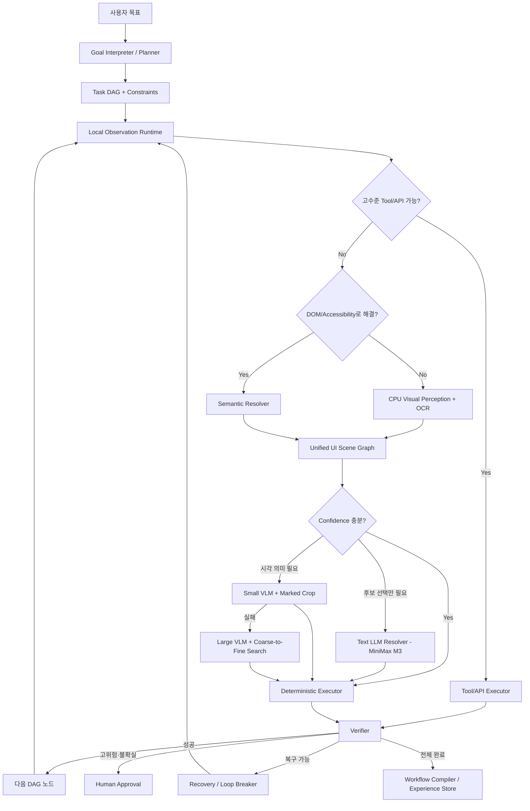

# 01. 시스템 아키텍처 및 런타임 구조

## 1. 설계 원칙 요약

```text
허가된 API/CLI/프로토콜        ← 가장 빠름 (GUI 미사용)
        ↓ 실패 또는 부재
DOM / Browser Accessibility / OS Accessibility
        ↓ 실패 또는 불완전
CPU 영상처리 + OCR + 템플릿 + 상태 추적
        ↓ 모호함
텍스트 LLM: 구조화된 후보 중 선택      ← MiniMax M3
        ↓ 시각 의미가 필요
소형 VLM: 표시된 후보 또는 크롭 영역 판단
        ↓ 여전히 실패
대형 VLM의 단계적 확대 탐색
        ↓ 고위험 또는 불확실
사람 승인/개입
```

**픽셀은 공통 최후 수단이지 공통 첫 수단이 아니다.**

- 브라우저: DOM/CDP/접근성 트리 우선
- Windows: UI Automation 우선
- Linux: AT-SPI 우선 (Phase 8)
- macOS: AXUIElement 우선 (Phase 8)
- 커스텀 캔버스·원격 화면·게임·접근성 미지원 앱: 스크린샷 분석 경로

---

## 2. 공통 인터페이스 기반 모듈형 아키텍처 (설계 가치)

### 2.1 핵심 철학: 공통화, 재사용성, 메모리 효율성

HPCU Runtime은 **공통 인터페이스(Protocol/ABC)를 유일한 결합 지점**으로 하는
모듈형 플러그인 아키텍처다. 모든 모듈은 다음 원칙을 따른다.

```text
┌────────────────────────────────────────────────────────────┐
│                    runtime_core                            │
│  Observer · Grounder · Executor · Verifier  (ABC only)    │
│                    Plugin Registry                         │
└────────────────────────────────────────────────────────────┘
         ▲                 ▲                 ▲
         │                 │                 │
  ┌──────┴──────┐   ┌──────┴──────┐   ┌──────┴──────┐
  │ Capture     │   │ Perception  │   │ Input       │
  │ Backend ABC │   │ (공통, OS무관)│   │ Injector ABC│
  └──────┬──────┘   └─────────────┘   └──────┬──────┘
         │  OS 플러그인만 여기 등록            │
  ┌──────┴───────────────────────────────────┴──────┐
  │ windows / linux / macos / browser / remote       │
  │  (각 패키지가 Capture + Structure + Input 구현)  │
  └─────────────────────────────────────────────────┘
```

### 2.2 모듈 추가/삭제 계약

모든 기능 모듈은 다음 조건을 충족해야 한다:

1. **단일 ABC 구현**: 모듈은 자신이 속한 도메인의 ABC 하나만 구현한다.
2. **생성자 주입**: 의존성은 생성자로만 받고, 내부에서 `import`하거나 전역 상태를
   참조하지 않는다.
3. **자체 등록 불가**: 모듈은 스스로 registry에 등록하지 않는다. 등록은
   `PluginRegistry.register(name, factory)`를 호출하는 부트스트랩 코드가 담당한다.
4. **제거 안전성**: 모듈을 registry에서 제거해도 다른 모듈이나 제어 루프가
   중단되지 않는다. core는 `registry.get(name)` 실패 시 fallback 또는 skip 처리.

```python
# plugin contract 예시
class Observer(ABC):
    """공통 인터페이스: 모든 observer 플러그인은 이 ABC를 구현한다."""

    @abstractmethod
    async def observe(self) -> ObservationDelta:
        """현재 화면 상태의 delta를 반환. 실패 시 ObservationError."""
        ...

    @abstractmethod
    def capabilities(self) -> ObserverCapabilities:
        """이 observer가 제공하는 기능 목록."""
        ...

# 등록
registry.register("browser", lambda cfg: BrowserObserver(cfg, playwright=dep))
registry.register("uia-win32", lambda cfg: Win32UIAObserver(cfg, backend=dep))
registry.register("at-spi-linux", lambda cfg: LinuxAtSpiObserver(cfg, bus=dep))
registry.register("ax-macos", lambda cfg: MacosAxObserver(cfg, ax=dep))
registry.register("remote-vnc", lambda cfg: RemoteVncObserver(cfg, session=dep))

# 사용 — core는 구체 구현을 모름
observer: Observer = registry.get(platform)
```

### 2.3 모듈 간 데이터 흐름과 메모리 효율성

모듈 간 데이터 전달은 다음 규칙을 강제한다:

| 규칙 | 설명 | 위반 시 결과 |
|---|---|---|
| **Zero-Copy Image** | 이미지 데이터는 shared memory handle만 전달. 절대 bytes/base64로 복사 금지 | GC pressure, 직렬화 비용, IPC 블로킹 |
| **Bounded Queue** | 모든 모듈 간 채널은 bounded queue. 소비자 지연 시 오래된 프레임 폐기 | 메모리 누적, back-pressure 역류 |
| **Delta-Only** | 전체 scene을 매번 전송하지 않고 delta(변경분)만 전파 | 불필요한 직렬화, 비교 비용 |
| **Schema Boundary** | 모듈은 다른 모듈의 내부 타입을 import하지 않음. schema에 정의된 DTO만 사용 | 순환 참조, 모듈 교체 불가 |
| **Immutable Transfer** | 모듈 경계를 넘는 객체는 생성 후 불변. 수정이 필요하면 새 객체 생성 | race condition, 디버깅 난해 |

```python
# shared memory handle 예시 — 이미지 복사 없음
@dataclass(frozen=True)
class FrameHandle:
    shm_id: str                 # shared memory 세그먼트 ID
    width: int
    height: int
    stride: int
    pixel_format: str           # "BGRA" | "BGR"
    timestamp_ns: int
    # bytes 데이터는 이 구조체에 포함되지 않음

# delta 전파 — 전체 scene이 아닌 변경분만
@dataclass(frozen=True)
class SceneDelta:
    base_version: int
    new_version: int
    added: tuple[UIElement, ...]
    removed: tuple[str, ...]    # element_id
    modified: tuple[UIElement, ...]
```

### 2.4 재사용성: 모듈을 플랫폼·환경 간 공유

공통 인터페이스가 재사용성을 어떻게 보장하는가:

- **Observer ABC** 하나로 `browser`, `uia-win32`, `at-spi-linux`, `ax-macos`,
  `remote-vnc` 모두 교체 가능. 제어 루프는 동일.
- **CaptureBackend ABC** 하나로 DXGI / ScreenCaptureKit / X11 / PipeWire /
  CDP / VNC framebuffer를 교체. Perception은 백엔드를 모른다.
- **InputInjector ABC** 하나로 SendInput / CGEvent / XTest·portal / CDP Input /
  VNC pointer를 교체. Executor는 주입 방식을 모른다.
- **Grounder ABC** 하나로 `semantic-text`, `template-match`, `ocr-position`
  전략을 조합하거나 개별 사용.
- **Verifier ABC** 하나로 `ui-state`, `file-exists`, `api-response` 등
  다양한 증거 유형을 통합.
- **Gateway ABC** 하나로 `openai-compatible`, `anthropic`, `ollama` 등
  모든 모델 제공자를 교체 가능.

플러그인 추가는 새 패키지를 `hpcu/platform/<os>/` 아래에 추가하고
부트스트랩에 `registry.register(...)` 한 줄을 추가하는 것으로 완료된다.
플러그인 삭제는 register 호출을 제거하고 패키지를 삭제하는 것으로 완료된다.
OS 모듈이 없어도 Perception·Grounder·Verifier·제어 루프는 동작해야 한다.

### 2.5 3층 분리: Capture · Perception · Input

화면을 다루는 코드는 **한 Observer에 몰지 않는다.** OS마다 다른 것과
모든 화면에서 같은 것을 강제로 분리한다. 상세는 `03-observation-layer.md`.

```text
[OS별 플러그인]                    [공통 런타임]                 [OS별 플러그인]
CaptureBackend ──FrameHandle──► Perception ──SceneDelta──► Executor
StructureObserver ──tree──►        OCR/shape/template          │
                                   Scene Graph fusion          ▼
                                                          InputInjector
                                                          (semantic 우선,
                                                           physical fallback)
```

| 층 | 책임 | OS 코드 허용 | 산출물 |
|---|---|---|---|
| **Capture** | 픽셀 획득, dirty ROI 힌트, 해상도/DPI 메타 | 예 (필수) | `FrameHandle` |
| **Structure** | DOM/AX/UIA/AT-SPI/AXUI 트리 | 예 (있으면) | 구조 요소 + native ref |
| **Perception** | OCR, 형상, 템플릿, fusion, tracking | **금지** | `SceneDelta` |
| **Input** | semantic action 또는 물리 마우스/키보드 | 예 (필수) | `ExecutionResult` |

불변식:

1. Perception·Scene Graph·Grounder는 `hpcu/platform/`을 import하지 않는다.
2. Capture는 바이트를 복사하지 않고 `FrameHandle`만 넘긴다.
3. Executor는 좌표를 직접 OS API에 넣지 않는다. `InputInjector`만 호출한다.
4. 지원하지 않는 capability는 침묵하지 않고 `Capability.UNSUPPORTED`를 반환한다.
5. 호스트 Linux, Docker Linux, Windows, macOS, 원격 VNC는 **같은 세 ABC**에
   등록되는 서로 다른 플러그인일 뿐이다.

### 2.6 CaptureBackend / InputInjector 계약

```python
class CaptureBackend(ABC):
    @abstractmethod
    async def start(self) -> None: ...

    @abstractmethod
    async def grab(self) -> FrameHandle:
        """최신 프레임 handle. bytes 복사 금지."""
        ...

    @abstractmethod
    def capabilities(self) -> CaptureCapabilities: ...


class InputInjector(ABC):
    @abstractmethod
    async def semantic(self, action: Action, element: UIElement) -> ExecutionResult:
        """UIA Invoke, AXPress, DOM click, AT-SPI action. 가능하면 이것만."""
        ...

    @abstractmethod
    async def physical(self, action: Action, point: ScreenPoint) -> ExecutionResult:
        """SendInput / CGEvent / XTest / portal / VNC. semantic 실패 시에만."""
        ...

    @abstractmethod
    def capabilities(self) -> InputCapabilities: ...
```

등록 예:

```python
registry.register("capture.windows-dxgi", WindowsDxgiCapture)
registry.register("capture.linux-x11", LinuxX11Capture)
registry.register("capture.linux-pipewire", LinuxPipewireCapture)
registry.register("capture.macos-sckit", MacosScreenCaptureKit)
registry.register("capture.browser-cdp", BrowserCdpCapture)
registry.register("capture.remote-vnc", RemoteVncCapture)

registry.register("input.windows", WindowsInputInjector)
registry.register("input.linux-xtest", LinuxXtestInjector)
registry.register("input.linux-portal", LinuxPortalInjector)
registry.register("input.macos-cgevent", MacosCgEventInjector)
registry.register("input.browser-cdp", BrowserCdpInjector)
registry.register("input.remote-vnc", RemoteVncInjector)
```

## 3. 전체 흐름 다이어그램



---

## 4. 컴포넌트 역할 분리

| 컴포넌트 | 책임 | 상세 문서 |
|---|---|---|
| Planner | 사용자 목표 해석, 제약조건 확정, 작업 DAG 생성 | 02, 06 |
| Observer | Capture+Structure facade. OS 플러그인 합성 | 03 |
| CaptureBackend | 픽셀 획득. DXGI/X11/PipeWire/SCKit/CDP/VNC | 03 |
| InputInjector | semantic 액션 또는 물리 마우스/키보드 | 03, 07 |
| Scene Builder | 여러 관찰 소스를 하나의 UI 객체 그래프로 통합 | 05 |
| Grounder | 자연어 조건을 실제 요소 ID로 연결 | 06 |
| Executor | 클릭·입력·스크롤·선택·호출을 결정론적으로 실행 | 07 |
| Verifier | 각 단계와 전체 작업의 완료 여부를 증거로 판정 | 07 |
| Recovery | stale element, 팝업, 반복 루프, 실패 후 재탐색 | 07 |
| Model Router | 텍스트 LLM, 소형 VLM, 대형 VLM 승격 결정 | 06, 08 |
| Compiler | 성공한 경로를 재사용 가능한 워크플로우로 변환 | 09 |
| Policy Engine | 권한, 위험도, 승인, 데이터 반출 정책 집행 | 10 |

---

## 5. 핵심 제어 루프

모델이 없을 때도 이 루프가 완전하게 동작해야 한다.

```python
while not task.complete:
    observation = observer.get_latest_delta()
    scene = scene_builder.update(observation)

    node = task.next_ready_node()

    result = deterministic_resolver.resolve(node.target, scene)

    if result.confident:
        action = executor.prepare(node, result.element_id)
    else:
        escalation = router.choose_tier(
            failure=result.failure_code,
            risk=node.risk,
            scene=scene
        )
        decision = escalation.resolve(node, scene, result.candidates)

        if decision.is_stale(scene.version):   # 응답 도착 시점 재검증
            continue

        action = executor.prepare(node, decision.target_id)

    if not policy.allow(action):
        task.pause_for_approval(action)
        continue

    execution = executor.execute(action)  # 내부에서 InputInjector.semantic/physical
    verification = verifier.verify(node.postconditions, execution)

    if verification.success:
        task.commit(node, verification.evidence)
    else:
        recovery.handle(node, scene, execution, verification)

compiler.consider(task.trajectory, task.evidence)
```

루프 불변식(invariants):

1. 모든 action은 policy.allow 통과 후에만 실행된다.
2. 모든 action 실행 후 postcondition 검증 없이는 commit되지 않는다.
3. 모델 응답은 schema validation + stale check 통과 후에만 사용된다.
4. 어떤 경로로도 고위험 action이 승인 없이 실행되지 않는다.

---

## 6. 프로세스/스레드 구성 (권장 파이프라인)

```text
Capture Thread
    ↓ shared memory frame (ring buffer, 최신 프레임 우선)
Delta Detector
    ↓ ROI queue (bounded queue)
Perception Workers
    ↓ element deltas
Scene Graph Actor
    ↓ scene version (단조 증가)
Resolver / Executor
    ↓ event
Verifier
```

원칙:

- bounded queue 사용 — 느린 소비자가 캡처를 막지 않음
- 오래된 프레임 폐기, 항상 최신 프레임 우선
- 이미지 전체를 JSON/base64로 전달하지 않음
- 프로세스 간 이미지는 shared memory / memory-mapped buffer
- 메타데이터만 protobuf/MessagePack 등으로 전달
- 느린 VLM 결과는 scene version으로 무효화

---

## 7. 내부 통신 설계

| 범위 | 방식 |
|---|---|
| 같은 프로세스 | typed channel |
| 로컬 프로세스 간 | Unix domain socket / Windows named pipe |
| 메타데이터 | protobuf (또는 MessagePack) |
| 이미지 | shared memory handle (`FrameHandle`). 플랫폼 버퍼를 그대로 wrap |
| 외부 API | HTTP/gRPC |
| 모델 연결 | provider-independent adapter (HTTP/SSE) |
| MCP | 외부 에이전트 노출용 선택 계층. 내부 hot path에 사용하지 않음 |
| OS native | Capture/Input 플러그인 내부에서만. core는 native handle을 보지 않음 |

---

## 8. 기술 스택 결정

### 8.1 MVP/프로토타입 (Phase 0~7 채택)

- Python 3.12+
- Playwright (브라우저 Capture/Structure/Input)
- pywinauto / UIA wrapper (Windows Structure + semantic Input)
- platform capture: DXGI / ScreenCaptureKit / X11·PipeWire / CDP / VNC
- platform input: SendInput / CGEvent / XTest·ydotool·portal / CDP / VNC
- OpenCV (영상처리 — OS 무관)
- PaddleOCR (주 OCR) + Tesseract (fallback/비교)
- SQLite (경험 저장소, trace 저장)
- FastAPI 또는 local IPC (데몬 인터페이스)
- JSON Schema / Pydantic (스키마 검증)
- 간단한 웹 Scene Inspector (개발 도구)

근거: 빠른 실험, OCR/CV 라이브러리 풍부, 오픈소스 재사용 용이.
한계: 장기적 캡처·IPC·메모리 복사 최적화. → Phase 8 이후 Rust core 이전 검토.

### 8.2 Production 목표 구조 (참고, 초기 강제 아님)

```text
Rust Runtime Core
├─ capture-abc / input-abc / scene graph / resolver / executor
├─ platform-windows / linux / macos / remote adapters
└─ browser-playwright adapter

Python Vision Worker
├─ OCR
├─ experimental CV
└─ optional OmniParser/VLM adapter

Go Control Plane (선택, 다중 머신 시점에 추가)
├─ workflow registry / API/auth/policy / dashboard backend
```

Rust 선정 사유: 낮은 오버헤드, 안전한 concurrency, native FFI, 단일 바이너리,
shared memory 고속 자료구조.

---

## 9. 권장 저장소 구조 (Python MVP 기준 조정판)

```text
dx-computer-use/
├─ apps/
│  ├─ hpcu-daemon/          # 런타임 데몬 진입점
│  ├─ hpcu-cli/             # CLI (run/replay/inspect/compile)
│  └─ scene-inspector/      # 웹 기반 디버깅 UI
├─ hpcu/                    # 핵심 패키지 (crates 대응)
│  ├─ runtime_core/         # 제어 루프, task DAG
│  ├─ capture/              # CaptureBackend ABC, ring buffer, tile hash (공통)
│  ├─ input/                # InputInjector ABC, 좌표 hit-test 계약 (공통)
│  ├─ platform/             # OS 플러그인만. core가 여기 내부를 import하지 않음
│  │  ├─ windows/           # DXGI capture, UIA structure, SendInput
│  │  ├─ linux/             # X11/PipeWire capture, AT-SPI, XTest/portal
│  │  ├─ macos/             # ScreenCaptureKit, AXUIElement, CGEvent
│  │  ├─ browser/           # CDP/Playwright capture·structure·input
│  │  └─ remote/            # VNC/RDP framebuffer capture + pointer/key
│  ├─ observation/          # Observer facade (Capture+Structure 합성)
│  ├─ vision/               # OCR, shape, template — OS 코드 금지
│  ├─ scene_graph/          # 통합 그래프, 인덱스, tracking
│  ├─ grounder/             # candidate scoring, confidence
│  ├─ executor/             # Action DSL 실행
│  ├─ verifier/             # evidence 평가
│  ├─ recovery/             # loop breaker, popup recovery
│  ├─ router/               # tier 선택, model call budget
│  ├─ gateway/              # model gateway (MiniMax M3 adapter 포함)
│  ├─ compiler/             # workflow compiler
│  └─ policy/               # risk policy, approval
├─ schemas/                 # JSON Schema (ui-element/scene/action/workflow/evidence/trace)
├─ workflows/
│  ├─ fixtures/             # 테스트용 fixture 사이트/앱 정의
│  └─ qualified/            # 검증 완료 워크플로우 번들
├─ benchmarks/              # browser/desktop/grounding/ocr/latency 하니스
├─ docs/                    # 본 문서군, architecture/, threat-model/, decisions/(ADR)
└─ tests/                   # unit / integration / replay / failure-injection
```

모듈 의존성 규칙:

- `runtime_core`는 하위 모듈의 인터페이스(protocol/ABC)에만 의존
- `gateway`는 HTTP/SSE만 알고, runtime 내부 타입을 import하지 않음 (DTO 변환은 router가 담당)
- `vision`은 `scene_graph` 스키마와 `FrameHandle`만 의존. `hpcu.platform` import 금지
- `platform/*`만 native API, OS SDK, compositor portal을 호출한다
- 순환 import 금지 — 위반 시 CI에서 검사

---

## 10. 설정 및 시크릿

- `.env`에서 `MINIMAX_API_KEY` 로드 (커밋 금지, `.gitignore` 등록)
- 런타임 설정은 `config/*.yaml`: SLO 임계값, confidence 임계값, tier budget, policy 기본값
- 모든 임계값은 코드 하드코딩 금지 — 설정 파일 + 기본값 구조로 관리

---

## 11. 성능 최적화 우선순위 (설계 전반 적용)

1. 모델 호출 횟수 감소
2. 불필요한 action step 감소
3. 전체 화면 분석 제거
4. 고정 sleep 제거
5. 구조 API 우선 사용
6. 반복 경로 컴파일
7. 이미지·메타데이터 복사 최소화

수치 목표(SLO)는 `11-quality-benchmark.md` §3 참조.

---

## 12. 프로젝트 규칙 문서

아키텍처 설계에 수반되는 프로젝트 전역 규칙은 다음 문서에 정의된다.

| 문서 | 내용 |
|---|---|
| `docs/rules/naming-conventions.md` | 파일명, 디렉터리명, Python 식별자, JSON 키 네이밍 규칙 (kebab-case 강제) |
| `docs/rules/testing-standards.md` | 테스트 계층 구조, 시뮬레이션/검증 프로세스, 커버리지 임계값, CI 게이트 |
| `AGENTS.md` | 구현자가 먼저 읽는 방향·불변식 |

본 문서에서 정의한 공통 인터페이스(ABC)와 플러그인 계약을 구현하는 모든 코드는
위 규칙 문서를 준수해야 한다.

문서 역할은 `00-overview-and-goals.md` §1.1. 이 문서가 소유하는 것은
런타임 모듈 경계와 repo 위치다.

관찰·캡처·입력 계약, capability matrix, 부트스트랩 선택, 권한은
`03-observation-layer.md`만 수정한다. 여기서 표를 복제하지 않는다.
